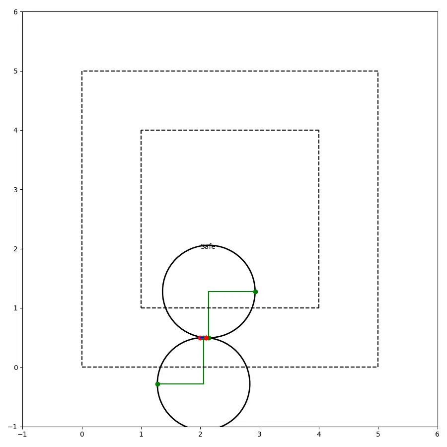
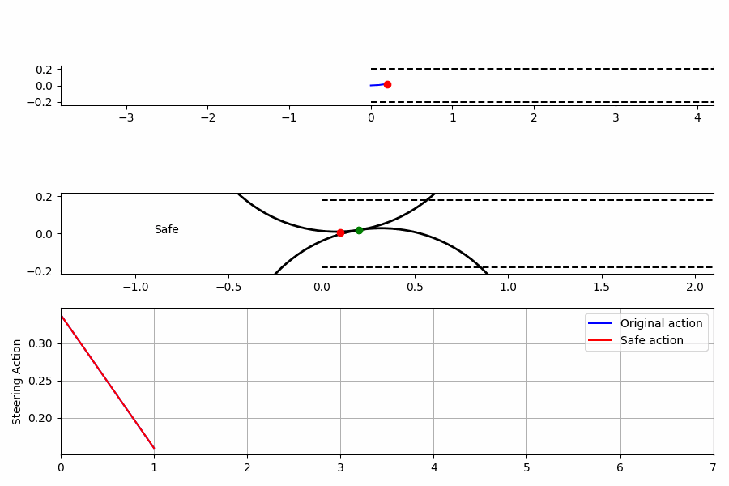

# Geometric Racing Safety

A geometric safety system that uses the vehicle's dynamic model to ensure a recursively feasible path inside the boundaries.

Currently, implemented for slow moving vehicles with the plan to upgrade to F1Tenth autonomous racing.

